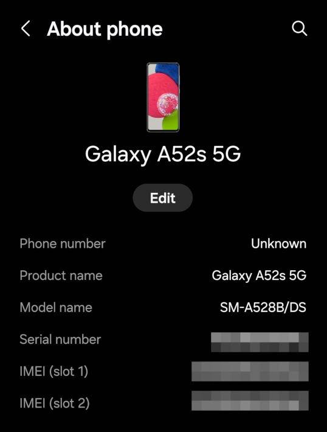

>[!CAUTION]  
>WIP as in Work In Progress
>This warning will be removed only after when this report is finished. 
# Install LineageOS on Samsung Galaxy A52s 5G (SM-A528B/DS)

>[!NOTE]
>This installation report includes instructions from the [LineageOS Wiki](https://wiki.lineageos.org/devices/a52sxq/) which are licenced under [ CC BY-SA 3.0.](https://creativecommons.org/licenses/by-sa/3.0/)

## Effects of lack of manufacturer's software support
Even though some of the Android smartphone manufacturers have extended the software support periods of their products there are still lots of perfectly functioning devices which aren't covered by the latest updates. Without these updates these devices might suffer from the negative effects including security vulnerabilities, app compatibility issues and hardware malfuntions for example. These phones also  usually have decreased resale value and users feel pressured to upgrade their devices.

## The cure
There are actively developed Android projects to solve the end of manufacturer's software support problem: [LineageOS](https://lineageos.org/), [CrDroid](https://crdroid.net/) and [/e/OS](https://e.foundation/e-os/) to name few.

Below we'll go through the steps of installing LineageOS to the Samsung Galaxy A52s 5G smartphone.

>[!NOTE]  
>First step is to go to `Settings` -> `About` menu and check your phone's `Product name` and `Model name` and check if they exist in supported devices list of .

  
Image 01 - About phone menu 

>[!WARNING]  
>Warning: The provided instructions are for LineageOS 22.2. These will only work if you follow every section and step precisely.
Do not continue after something fails!

## Pre-Install instructions 

1. Connect the device to a Wi-Fi network.
2. Enable Developer Options by pressing the “Build Number” option at least 7 times, in the “Settings” app within the “About” menu
- From within the Developer options menu, enable OEM unlock.
3. Download `vbmeta.img` from [here](https://download.lineageos.org/devices/a52sxq/builds).
4. Open a Command Prompt in the folder where the file was downloaded and TAR the file by running tar --format=ustar -cvf vbmeta.tar vbmeta.img
5. Power off the device, and boot it into download mode:
- With the device powered off, hold Volume Up + Volume Down and connect USB cable to PC.
- Now, click the button that the onscreen instructions correlate to “Device unlock mode” and/or “Unlock Bootloader”.
- Device will restart, repeat steps 1 and 2 to enable the Developer Options menu again.
- Verify that “OEM Unlock” is still enabled and continue to step 6
6. Download and install the necessary drivers.
- Download the newest Samsung drivers from here.
- Install `SAMSUNG_USB_Driver_for_Mobile_Phones.exe`.
7. Download [this](https://undocumented.software/Odin_3.13.1.zip) version of Odin.
8. Extract “Odin_3.13.1.zip”.
9. Run `Odin3 v3.13.1` found in the newly extracted “Odin_3.13.1” folder.
10. Check the box labeled next to the button labeled “AP”, and then click the “AP” button.
- In the menu that pops up, select the newly created custom VBMeta .tar file.
11. Power off the device, and again boot it into download mode:
- With the device powered off, hold `Volume Up` + `Volume Down` and `connect USB cable to PC`.
12. Check in the top left of the Odin window that you see a valid device, it will show up as something like COM0.

>[!TIP]  
Tip: The COM port, or the number succeeding COM, may be any valid number.  

13. Click “Start”. A transfer bar will appear on the device showing the VBMeta image being flashed.
14. Your device will reboot, you may now unplug the USB cable from your device.
15. The device will demand you factory reset, please follow the onscreen instructions to do so.
16. Run through Android Setup skipping everything you can, then connect the device to a Wi-Fi network.
17. Re-enable Development settings by clicking the “Build Number” option 10 times, in the “Settings” app within the “About” menu, and verify that “OEM Unlock” is still enabled in the “Developer options” menu.

